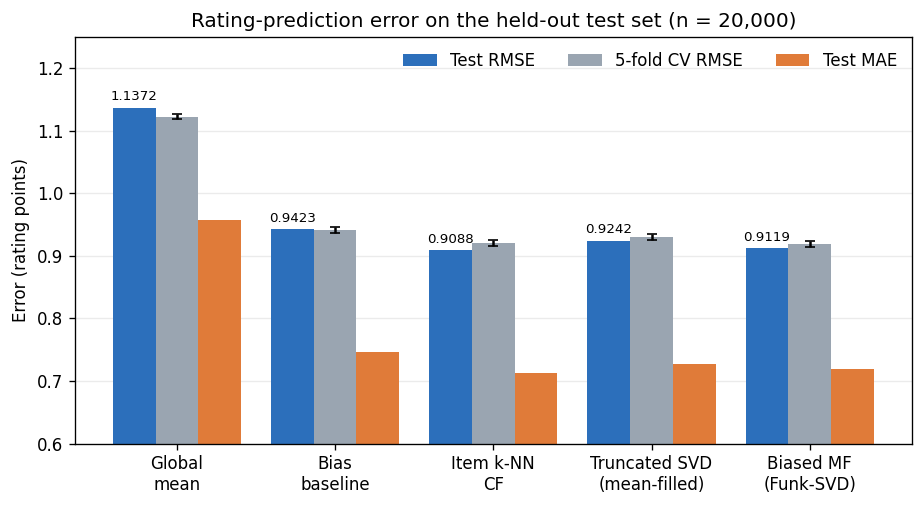
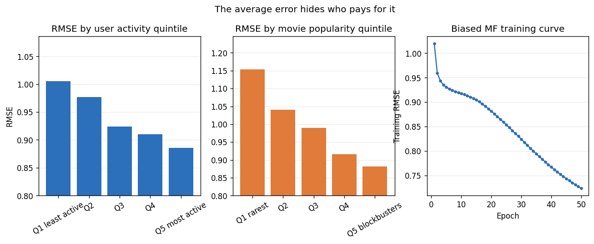
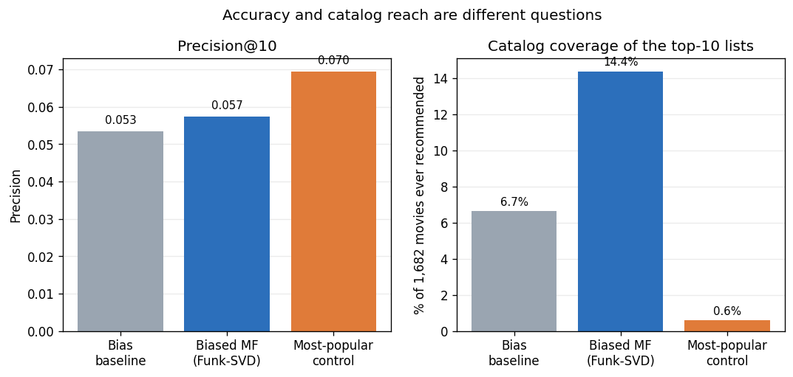

# MovieLens 100K Recommender System

A **collaborative-filtering** project that predicts how a user will rate a movie they have not
seen, then turns those predictions into a top-ten recommendation list. Five models are
compared, from a global-mean floor to **item-based k-NN** and **biased matrix factorization
(Funk-SVD)**, with the emphasis on an honest evaluation protocol rather than a single
headline number.

Built with NumPy, pandas, scikit-learn, and Matplotlib in a single Jupyter notebook that runs
top to bottom in Google Colab or locally, with no extra dependencies.

*PhDAI 732: Fundamentals of AI-Enabled Systems, University of the Cumberlands. Group project
by **Manoj Kashyap Ranganath**, **Onyebuchi Asogwa**, **Blake Mires** (dataset exploration &
preprocessing), and **Jose M. Santiago Echevarria** (model development & evaluation).*

---

## Problem

A streaming service earns nothing from a catalog a subscriber never opens. The scarce resource
is attention, the ten slots on the home screen, so the business question is *which ten titles
is this subscriber most likely to enjoy?*

Restated as an analytics problem: given a history of user-movie ratings, **predict the rating a
user would give an unseen movie** (a regression task, scored with RMSE and MAE), then rank those
predictions to build the list. There is no feature matrix here, only a **943 by 1,682 grid that
is 93.70% empty**, so predictions must be borrowed from other users and other movies.

**Dataset:** MovieLens 100K (Harper & Konstan, 2015): 100,000 ratings, 943 users, 1,682 movies.
The dataset is committed here, so the notebook runs without downloading anything.

---

## Approach

1. **Acquire and verify.** The notebook loads the dataset, with every quality claim checked rather than
   assumed: no missing values, no duplicate rows, no repeated user-movie pairs, all ratings in
   the range 1 to 5. The cleaning steps remove **zero** rows and are kept deliberately,
   because they document the standard the data had to meet.
2. **Explore.** Ratings are positively skewed (mean **3.5299**; 55.38% are 4 or 5), and
   participation is long-tailed on both sides: the top 10% of titles absorb **42.70%** of all
   ratings, while **530 movies (31.5% of the catalog)** have fewer than ten ratings each.
3. **Leak-free split.** 80/20 **stratified by user**, so no user lands entirely in the test set.
   Hyperparameters are chosen on a validation set carved out of *training data only*; the test
   set is touched **once**. 26 movies never appear in training (28 test rows, 0.140%) and are
   handled as explicit cold starts.
4. **Five models, escalating.** Global mean, then a regularized bias model (mu + b_u + b_i), then
   item-based k-NN on baseline residuals with shrunk cosine similarity, then a truncated SVD of
   a mean-filled matrix, and finally biased matrix factorization trained by SGD on observed
   ratings only.
5. **Evaluate honestly.** Held-out RMSE/MAE, 5-fold cross-validation for stability, error
   broken out by user activity, movie popularity and demographics, and a **top-10 evaluation
   against a non-personalized most-popular control**.

---

## Results

| Model | Test RMSE | Test MAE | 5-fold CV RMSE |
|---|---|---|---|
| Global mean | 1.1372 | 0.9566 | 1.1228 ± 0.0041 |
| Bias baseline (mu + b_u + b_i) | 0.9423 | 0.7459 | 0.9419 ± 0.0046 |
| **Item-based k-NN CF** | **0.9088** | **0.7127** | 0.9207 ± 0.0047 |
| Truncated SVD (mean-filled) | 0.9242 | 0.7268 | 0.9299 ± 0.0047 |
| **Biased MF (Funk-SVD)** | 0.9119 | 0.7194 | **0.9189 ± 0.0045** |



**The two best models trade places depending on the protocol.** k-NN wins the single held-out
test split (0.9088); matrix factorization wins under cross-validation (0.9189). The gap between
them, 0.0018, is smaller than either model's fold-to-fold standard deviation, so the
defensible claim is that both beat the baselines and are *statistically indistinguishable from
each other*, not that one is the winner.

**Skipping the missing values beats inventing them.** Factorizing only the observed ratings
(0.9119) is measurably better than factorizing a mean-filled matrix (0.9242), because 94% of that
filled matrix is manufactured, and the classical SVD spends its capacity reconstructing values
we made up.

### The average error hides who pays for it



| Slice | Best group | Worst group |
|---|---|---|
| User activity | 0.8857 (most active) | **1.0056** (least active) |
| Movie popularity | 0.8815 (blockbusters) | **1.1539** (rarest) |
| Self-reported gender | 0.8865 (male) | **0.9703** (female) |

The model serves new and casual subscribers worst, exactly the people most likely to cancel,
and that disparity is invisible in the headline RMSE, which is weighted by rating volume and so
dominated by power users. Demographics are used **only to audit** the model, never as inputs.

### Accuracy is not the same as a good recommendation list



| Top-10 list | Precision@10 | Recall@10 | Catalog coverage |
|---|---|---|---|
| Bias baseline | 0.0535 | 0.0398 | 6.66% |
| Biased MF (Funk-SVD) | 0.0574 | 0.0438 | **14.39%** |
| Most-popular (no personalization) | **0.0695** | **0.0973** | 0.59% |

The non-personalized control **beats both personalized models on precision and recall** while
touching 0.59% of the catalog. Two things drive it: relevance is defined by held-out ratings and
users overwhelmingly rate popular films, so the ground truth is itself popularity-biased; and a
model tuned to minimize squared error will happily rank a title with two training ratings first,
which is how *Santa with Muscles* reached a top-ten list. **Optimizing RMSE is not the same as
building a good recommendation list**, and this project measures the gap instead of assuming it
away.

---

## Key takeaways

- A difference smaller than the cross-validation standard deviation is not a winner. Report it
  as a tie.
- Skipping missing entries beats imputing them: Funk-SVD on observed ratings scores better than
  a truncated SVD on a filled matrix.
- A single RMSE averages over a very uneven population; break it out before trusting it.
- Accuracy and catalog reach are different axes, and a popularity control is the cheapest way to
  find out whether personalization is earning its keep.
- Ethical risk here is measurable, not abstract: unequal service quality, popularity bias,
  feedback loops, and the re-identification risk carried by a learned taste vector
  (Narayanan & Shmatikov, 2008).

---

## Repository structure

```
movielens-recommender-system/
├── movielens-recommender-system.ipynb              # the full workflow, executed end to end
├── GroupProject_Report.docx                        # the written report (draft)
├── images/recommender/                             # the four report figures
├── ml-100k/                                        # the MovieLens 100K dataset
├── ml-100k.zip                                     # the original download
├── New_MovieLens_100k_dataset_original.ipynb.bak   # the team's pre-model notebook
├── README.md
└── .gitignore
```

The dataset is committed, so the notebook runs offline with no download step. The report is a
**draft**, included so the team can review it alongside the code.

---

## Running it

```bash
python -m venv .venv && source .venv/bin/activate
pip install numpy pandas scikit-learn matplotlib jupyter
jupyter notebook movielens-recommender-system.ipynb
```

Run the notebook top to bottom; it reads `ml-100k/`, tunes and evaluates all five models, and
writes the figures under `images/recommender/`. It also runs unchanged in Google Colab, where the
paths detect `/content` automatically and the dataset is fetched from GroupLens if absent. Developed on Python 3.9.6 with NumPy 2.0.2,
pandas 2.3.3, scikit-learn 1.6.1 and Matplotlib 3.9.4, seed fixed at 42 throughout. The full
run takes a few minutes; the matrix-factorization grid search is the slow part.

---

## References

- Harper, F. M., & Konstan, J. A. (2015). The MovieLens datasets: History and context.
  *ACM TiiS, 5*(4), 1–19.
- Koren, Y., Bell, R., & Volinsky, C. (2009). Matrix factorization techniques for recommender
  systems. *Computer, 42*(8), 30–37.
- Koren, Y. (2010). Factor in the neighbors: Scalable and accurate collaborative filtering.
  *ACM TKDD, 4*(1), 1–24.
- Sarwar, B., Karypis, G., Konstan, J., & Riedl, J. (2001). Item-based collaborative filtering
  recommendation algorithms. *WWW '01*, 285–295.
- Narayanan, A., & Shmatikov, V. (2008). Robust de-anonymization of large sparse datasets.
  *IEEE S&P 2008*, 111–125.
- Pedregosa, F., et al. (2011). Scikit-learn: Machine learning in Python. *JMLR, 12*, 2825–2830.
